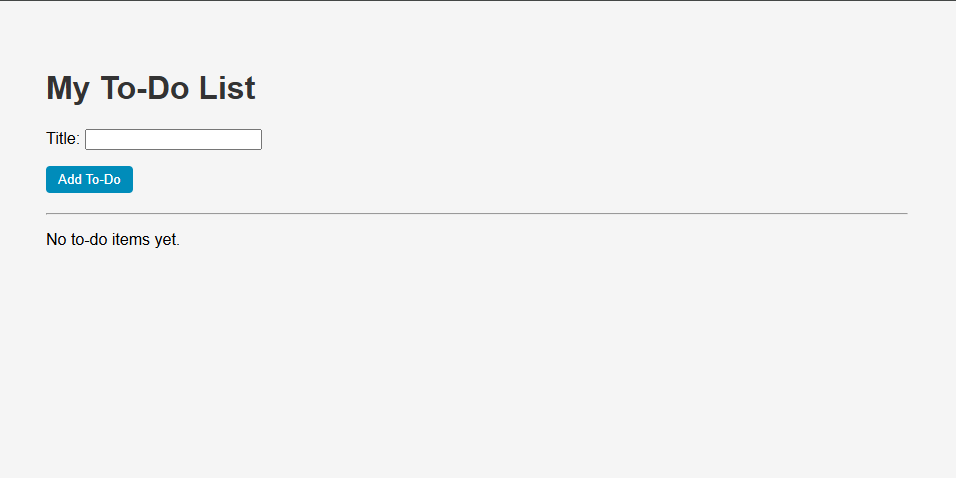
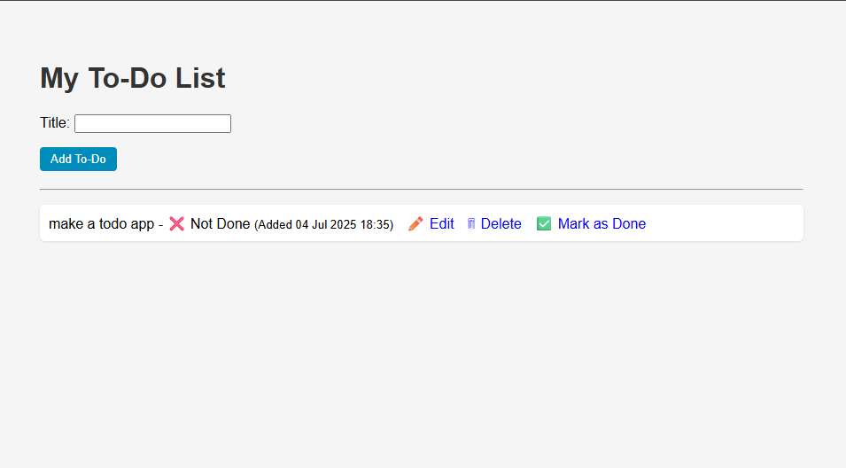
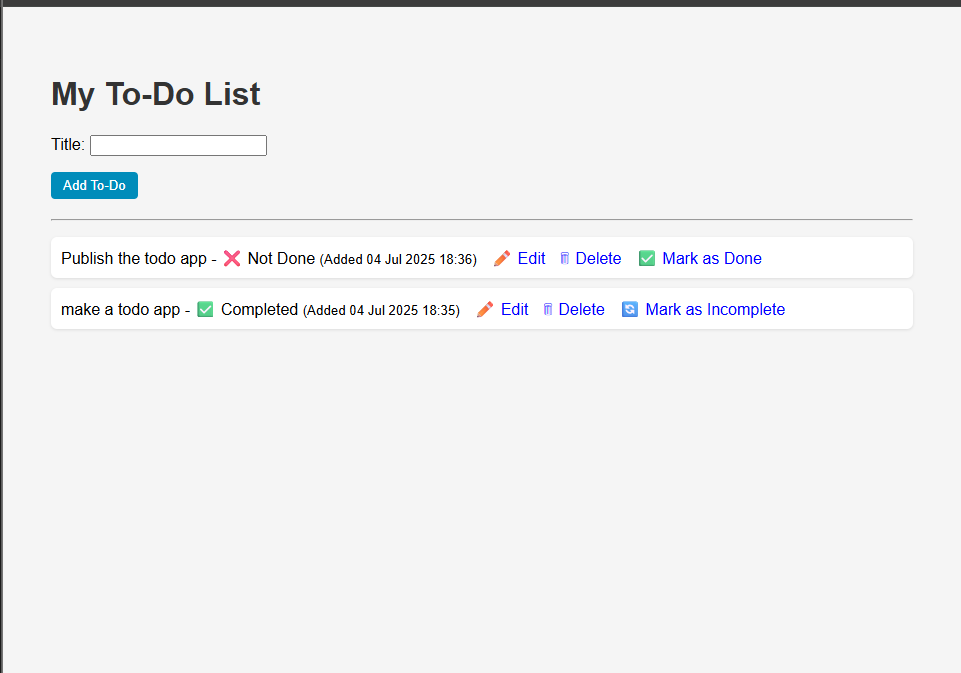
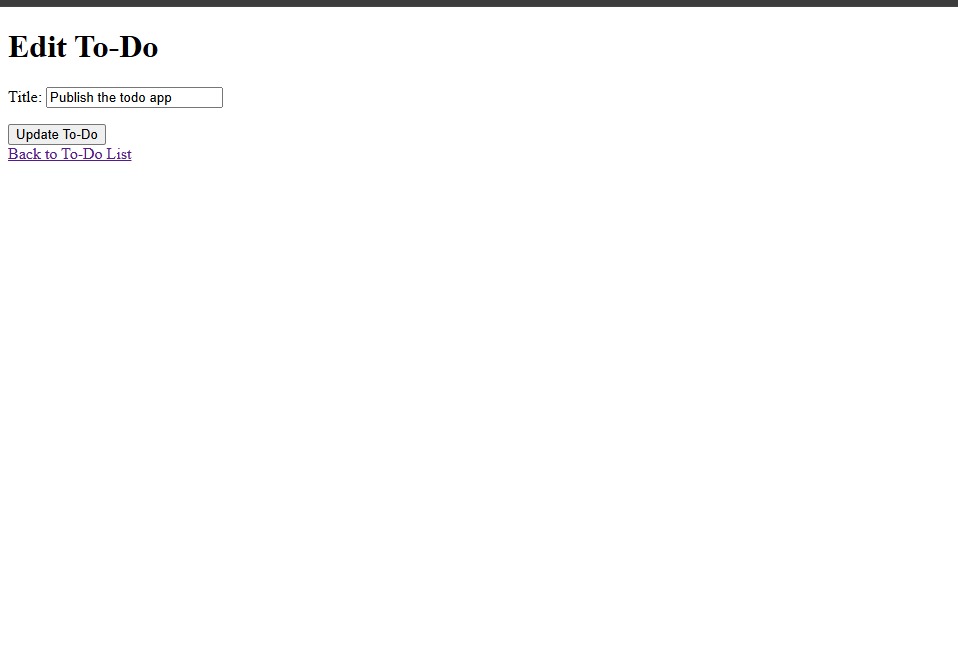

# Django To-Do List App

A simple To-Do List web application built with Django. This app allows you to add, edit, delete, and mark tasks as completed.

## Features

-   Add new to-do items
-   Edit existing to-do items
-   Delete to-do items
-   Mark items as completed or incomplete
-   List all to-dos ordered by creation date

## Screenshots

Below are some screenshots of the application:






## Project Structure

```
todoproject/
├── manage.py
├── db.sqlite3
├── readme.md
├── assets/
│   ├── home.png
│   ├── add_todo.png
│   ├── edit_todo.png
│   └── completed_todo.png
├── todoapp/
│   ├── admin.py
│   ├── apps.py
│   ├── forms.py
│   ├── models.py
│   ├── tests.py
│   ├── urls.py
│   ├── views.py
│   ├── migrations/
│   ├── static/
│   │   └── todo/
│   └── templates/
│       └── todo/
├── todoproject/
│   ├── settings.py
│   ├── urls.py
│   ├── wsgi.py
│   └── asgi.py
└── .gitignore
```

## Quick Start

1. **Clone the repository**

2. **Install dependencies**

    ```sh
    pip install django
    ```

3. **Apply migrations**

    ```sh
    python manage.py migrate
    ```

4. **Run the development server**

    ```sh
    python manage.py runserver
    ```

5. **Open your browser**
    - Go to [http://127.0.0.1:8000/](http://127.0.0.1:8000/)

## Main Files

-   App logic: [`todoapp/views.py`](todoapp/views.py)
-   Model: [`todoapp/models.py`](todoapp/models.py)
-   Forms: [`todoapp/forms.py`](todoapp/forms.py)
-   Templates: [`todoapp/templates/todo/home.html`](todoapp/templates/todo/home.html), [`todoapp/templates/todo/update_todo.html`](todoapp/templates/todo/update_todo.html)
-   Static files: [`todoapp/static/todo/style.css`](todoapp/static/todo/style.css)
-   Admin registration: [`todoapp/admin.py`](todoapp/admin.py)
-   Project settings: [`todoproject/settings.py`](todoproject/settings.py)

## License

This project is for learning and demonstration
